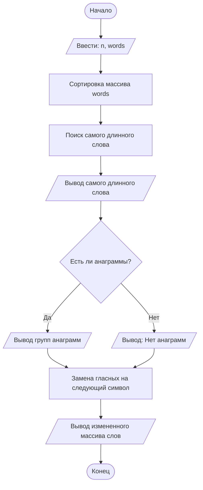

## Отчет по лабораторной работе № 2

#### № группы: `ПМ-2403` 

#### Выполнил: `Антонова Ирина Алексеевна` 

#### Вариант: `4` 

### Cодержание: 

- [Постановка задачи](#1-постановка-задачи)
- [Входные и выходные данные](#2-входные-и-выходные-данные)
- [Выбор структуры данных](#3-выбор-структуры-данных)
- [Алгоритм](#4-алгоритм)
- [Программа](#5-программа)

### 1. Постановка задачи

- Условия задачи

Напишите программу на Java, которая выполняет следующее действие с равномерным массивом слов:
1) Cчитает c консоли число N, а затем N слов и заполняет размером N. 
2) Сортирует массив слов в порядке возрастания длины слова. Если длины равны, сортирует в алфавитном порядке.
3) Находит и выводит самое длинное слово в массиве.
4) Выводит слова, которые являются анаграммами друг друга, группируя их вместе. 
5) Заменяет в каждом слове все гласные буквы на следующий по алфавиту символ и выводит полученный массив.
- Задачу можно разделить на 5 пунктов:
1) Создать число N, которое вводится с консоли, создать массив, который заполняется N элементами.
2) Создаём 2 цикла для пузырьковой сортировки длинн слов по возврастанию, если длинны равны, то они сортируются по алфавиту.
3) Создать массив и цикл for, в массиве хранится самое длинное слово, которое ищется с помощью цикла.
4) Создать массив, чтобы помещать слова, которые уже были проверены как анаграммы. Использовать цикл, для поверки, есть ли у слова анаграмма. Если у слова нет анаграмм, выводится сообщение "Нет анаграмм".
5) Создать список гласных в нижнем и верхнем регистре. Для каждого символа проверяется, является ли он гласным.
Если да, символ заменяется на следующий по алфавиту.
### 2. Входные и выходные данные
#### Данные на вход 
На вход программа получаем 1 целое число и слова, слова храняться в типе данных String, число в int, потому что оно показывает количество слов в массиве
| | Тип | min значение | max значение | 
|----------------------|-------------|--------------|----------------|
|N| Целое число | 0 | 10<sup>9</sup> |
|worlds|Сторока|0|2<sup>30</sup>|
#### Данные на выход 
Программа должна вывести самое длинное слово, вывести слова, которые являются анаграммами, и получившиеся слова, в которых каждая гласная заменена на следующую по алфавитую
| | Тип | min значение | max значение | 
|----------------------|-------------|--------------|----------------|
|longestWord|Сторока|0|2<sup>30</sup>|
|worlds|Сторока|0|2<sup>30</sup>|

### 3. Выбор структуры данных
На вход программа получает целое число и слова

| | Название переменной | Тип (в Java) | 
|----------------------|---------------------|----------------|
|N| n | int | 
|Массив| words | String | 

Для сортировки массива использую флаг

| | Название переменной | Тип (в Java) | 
|----------------------|---------------------|----------------|
|Флаг| f | boolean | 

Чтобы найти самое длинное слово создаю переменную для хранения

| | Название переменной | Тип (в Java) | 
|----------------------|---------------------|----------------|
|Самое длинное слово| longestWord | String | 

Для поиска анаграмм создаю переменную флаг и массив, в котором хранится информация, есть ли у слова анаграмма. Если слова равной длины, то создаю массив для выполнения подсчета количества вхождений символов в строке.

| | Название переменной | Тип (в Java) | 
|----------------------|---------------------|----------------|
|Флаг| hasAnyAnagrams | boolean |
|Массив| visited | boolean | 
|Массив| charCount | int | 
|Флаг| areAnagrams | boolean |

Для замены глассных создаю массив, в котором перечисляю глассные, выделяю место под строку, где будут хранится переделанные слова. Создаю флаг и переменную для хранения букв слова.

| | Название переменной | Тип (в Java) | 
|----------------------|---------------------|----------------|
|Массив| vowels | char | 
|Строка| newWord | String |
|Хранение букв| ch | char | 
|Флаг| isVowel | boolean |

### 4. Алгоритм
Алгоритм выполнения программы: 
1) Ввод данных:
Пользователь вводит количество слов n.
Затем вводит n строк, которые добавляются в массив words.
2) Сортировка массива слов:
Сортирует массив words по длине слов.
Если длины слов равны, они сортируются в алфавитном порядке.
3) Поиск самого длинного слова:
Пробегает по массиву, находит слово с максимальной длиной и выводит его.
4) Поиск анаграмм:
Для каждого слова проверяет, есть ли другие слова, которые являются его анаграммами.
Анаграммы группируются и выводятся вместе. Если анаграммы не найдены, выводится сообщение "Нет анаграмм".
5) Замена гласных букв:
В каждом слове заменяются все гласные буквы на следующий по алфавиту символ.
Преобразованный массив выводится.



### 5. Программа
```java
import java.io.PrintStream;
import java.util.Scanner;
public class Main {
    public static Scanner in = new Scanner(System.in);
    public static PrintStream out = System.out;
    public static void main(String[] args) {
        // 1. Считывание числа N и массива слов
        int n = in.nextInt();
        in.nextLine(); // Считываем остаток строки
        String[] words = new String[n];
        for (int i = 0; i < n; i++) {
            words[i] = in.nextLine();
        }
        // 2. Сортировка массива по длине и алфавиту
        for (int i = 0; i < n - 1; i++) {
            for (int j = 0; j < n - i - 1; j++) {
                boolean f = false;
                // Сравнение по длине
                if (words[j].length() > words[j + 1].length()) {
                    f = true;
                }
                // Если длины равны, сравнение по алфавиту
                else if (words[j].length() == words[j + 1].length()) {
                    for (int k = 0; k < words[j].length(); k++) {
                        if (words[j].charAt(k) > words[j + 1].charAt(k)) {
                            f = true;
                            break;
                        } else if (words[j].charAt(k) < words[j + 1].charAt(k)) {
                            break;
                        }
                    }
                }
                if (f) {
                    String z = words[j];
                    words[j] = words[j + 1];
                    words[j + 1] = z;
                }
            }
        }
        // 3. Поиск самого длинного слова
        String longestWord = words[0];
        for (int i = 1; i < n; i++) {
            if (words[i].length() > longestWord.length()) {
                longestWord = words[i];
            }
        }
        out.println(longestWord);
        // 4. Группировка анаграмм
        boolean hasAnyAnagrams = false;
        boolean[] visited = new boolean[n];
        for (int i = 0; i < n; i++) {
            if (!visited[i]) {
                boolean hasAnagrams = false;
                visited[i] = true;
                for (int j = i + 1; j < n; j++) {
                    if (!visited[j]) {
                        // Проверка, являются ли слова анаграммами
                        if (words[i].length() == words[j].length()) {
                            int[] charCount = new int[256];
                            boolean areAnagrams = true;
                            for (int k = 0; k < words[i].length(); k++) {
                                charCount[words[i].charAt(k)]++;
                                charCount[words[j].charAt(k)]--;
                            }
                            for (int k = 0; k < 256; k++) {
                                if (charCount[k] != 0) {
                                    areAnagrams = false;
                                    break;
                                }
                            }
                            if (areAnagrams) {
                                if (!hasAnagrams) {
                                    out.print(words[i] + " ");
                                    hasAnagrams = true;
                                }
                                out.print(words[j] + " ");
                                visited[j] = true;
                            }
                        }
                    }
                }
                if (hasAnagrams) {
                    out.println();
                    hasAnyAnagrams = true;
                }
            }
        }
        if (!hasAnyAnagrams) {
            out.println("Нет анаграмм");
        }
        // 5. Замена гласных букв
        char[] vowels = {'a', 'e', 'i', 'o', 'u', 'A', 'E', 'I', 'O', 'U'};
        for (int i = 0; i < n; i++) {
            String newWord = "";
            for (int j = 0; j < words[i].length(); j++) {
                char ch = words[i].charAt(j);
                boolean isVowel = false;
                // Проверка, является ли символ гласной
                for (int k = 0; k < vowels.length; k++) {
                    if (ch == vowels[k]) {
                        isVowel = true;
                        break;
                    }
                }
                // Если символ гласный, заменить на следующий
                if (isVowel) {
                    ch = (char) (ch + 1);
                }
                newWord += ch;
            }
            words[i] = newWord;
        }
        for (int i = 0; i < n; i++) {
            out.println(words[i]);
        }
    }
}
```

### 6. Анализ правильности решения

1. Тест на корректность работы программы

- Input:
    ```
    5
    rat
    tar
    art
    hello
    world
    ```
- Output:
    ```
    hello
    art rat tar 
    brt
    rbt
    tbr
    hfllp
    wprld
    ```
2. Тест на корректность работы программы
- Input:
    ```
    4
    apple
    banana
    grape
    orange
    ```
- Output:
    ```
   banana
    Нет анаграмм
    bpplf
    grbpf
    bbnbnb
    prbngf
    ```
